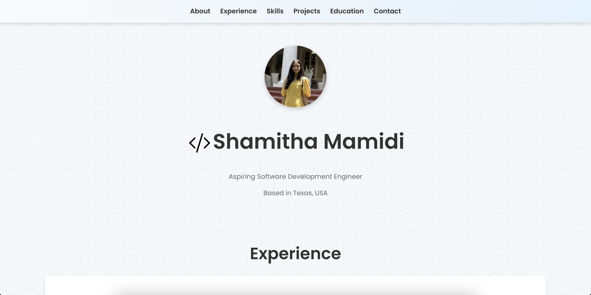

# Shamitha Mamidi - Portfolio

[Live Website 🚀](https://shamithamamidi.netlify.app/)

Welcome to my personal portfolio website!  
This project showcases my skills, projects, and experience as an aspiring Software Development Engineer.

---

## ✨ Features

- **Modern UI**: Built with React, TypeScript, and Vite for fast performance and a smooth developer experience.
- **Responsive Design**: Looks great on desktop and mobile devices.
- **Animated Sections**: Flashy UI with typing text effects and subtle animations.
- **Project Highlights**: Detailed project descriptions with links to GitHub repositories.
- **Contact Section**: Easy ways to connect via LinkedIn, GitHub, email, or phone.

---

## 🛠️ Tech Stack

- [React](https://react.dev/)
- [TypeScript](https://www.typescriptlang.org/)
- [Vite](https://vitejs.dev/)
- [Framer Motion](https://www.framer.com/motion/) (for animations)
- [React Icons](https://react-icons.github.io/react-icons/) (for icons)
- [CSS3](https://developer.mozilla.org/en-US/docs/Web/CSS) (custom styling)

---

## 📦 Getting Started

1. **Clone the repository:**
   ```sh
   git clone https://github.com/Shamitha24/Portfolio.git
   cd Portfolio
   ```

2. **Install dependencies:**
   ```sh
   npm install
   ```

3. **Start the development server:**
   ```sh
   npm run dev
   ```

4. **Open in your browser:**
   Visit [http://localhost:5173](http://localhost:5173) (or the port shown in your terminal).

---

## 📁 Project Structure

```
src/
  components/    # React components (About, Projects, Experience, Contact, etc.)
  styles/        # CSS files for styling
  assets/        # Images and static assets
  App.tsx        # Main app component
  main.tsx       # Entry point
```

---

## 📝 Customization

- **Update your info:**  
  Edit the files in `src/components/` (About, Projects, Experience, Contact) to add your own details.
- **Change styles:**  
  Modify CSS in `src/styles/` to personalize the look and feel.

---

## 📤 Deployment

This site is deployed on [Netlify](https://www.netlify.com/).  
You can deploy your own version easily by connecting your GitHub repo to Netlify or Vercel.

---

## 📬 Contact

Feel free to connect with me via [LinkedIn](https://www.linkedin.com/in/shamitha-mamidi-1556a0233/) or [GitHub](https://github.com/Shamitha24).

---

## 🖼️ Preview

 <!-- Add a screenshot if available -->

---

## License

This project is open source and available under the [MIT License](LICENSE).

---
